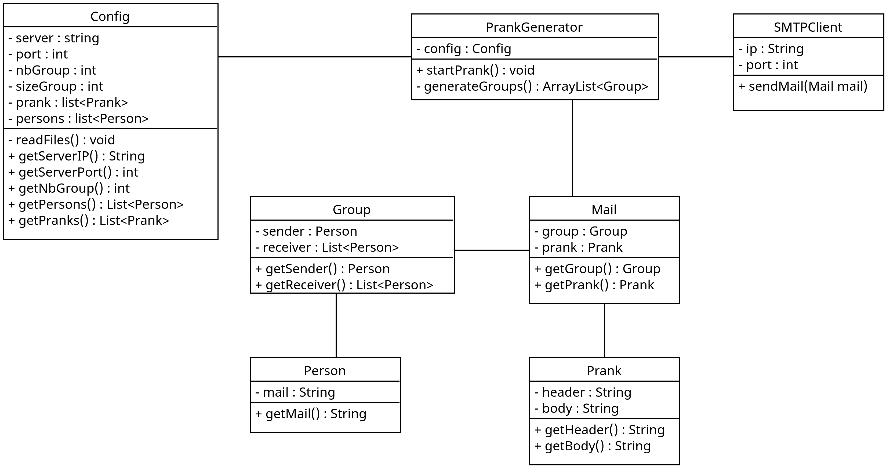

# DAI Labo4

Authors: Joris Décoppet, Dorian Niclass

---

## Description
This project is an implementation of an SMTP client in Java. It as been made for the DAI course at HEIG-VD. It's a program that can send emails containing a prank message to a list of victims.
The list of victims is read from a file, and the list of prank messages is read from another file. The server is configured with a configuration file.

## Mock Server

## Instructions
To test the server we used an SMTP mock server. It's a service that will receive the emails and display them in a web interface. It's very useful to test the program without sending real emails.

### Setting up mockmock

You may need a mock server to test the application.  
We used this docker image of mockmock : https://hub.docker.com/r/mmoayyed/mockmock

Pull the docker image  
```docker pull mmoayyed/mockmock```

Start the container  
```docker run -d -p 25:25000 -p 8282:8282 --name mockmock mmoayyed/mockmock```

### Setting up the PrankGenerator
The configuration file is located at the root of the project in the folder **configs**.  
Default configuration file content:  
```
server_ip = "127.0.0.1"
server_port = 25000
nb_group = 4
size_group = 4
```

**server_ip** and **server_port** is the address of the SMTP server you want to use. Set it to your mockmock instance for testing.  
**nb_group** is the number of group of people you want to form. It should be higher than 0.  
**size_group** is the number of people in each group. One of these person will be the sender of the mail, the others the victims. It should be higher than 2 (1 sender and 2 victims).

#### Add pranks
To add a prank into the application you have to create a file in the folder **configs/prank**. The names of the files are not important. The prank should be written with an header in the first line and a body as you want in the other lines. The header is the subject of the email. The body is the content of the email.

#### Add persons
To add a new victim you have to add the email in the file **persons.txt** located in the folder **configs**. You have to add one email per line.

## Implementation

### Class Diagram



`PrankGenerator` is the main class of the app.

`Config` manage the configuration files.

`SMTPClient` is the class that implements all the SMTP logic. The `sendMail(Mail mail)` method send the mail given as parameter.

`Mail` contains a `Group` and a `Prank`. It is used by the SMTPClient to send mails.

`Prank` represent a mail prank. It contains a header (title of the mail) and a body.

`Group` is a class that represent a group of persons. It conatains a sender with a `Person` and a list of victims as `Arraylist<Person>`.

`Person` is a class that represent a person with an email address.


### Our approach

#### Config management

We use the TOML format for the config file. TOML is minimal and easily readable format.  
To implement the parsing of the TOML file, we used the [toml4j](https://github.com/mwanji/toml4j) library.

The `Config` class manage the differents configuration files. This class contains a `ConfigData` class that represent the content of the config file and is used by toml4j to parse the file. Properties of `ConfigData` that are not needed to be store in the config file are annoted with the `transient` keyword.  
`Config` has an instance of `ConfigData` named `data`.

After the main config file has been read, the persons et prank files are read and populate the `pranks` and `persons` of `data`.